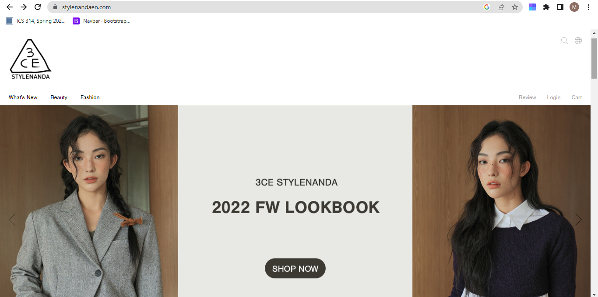
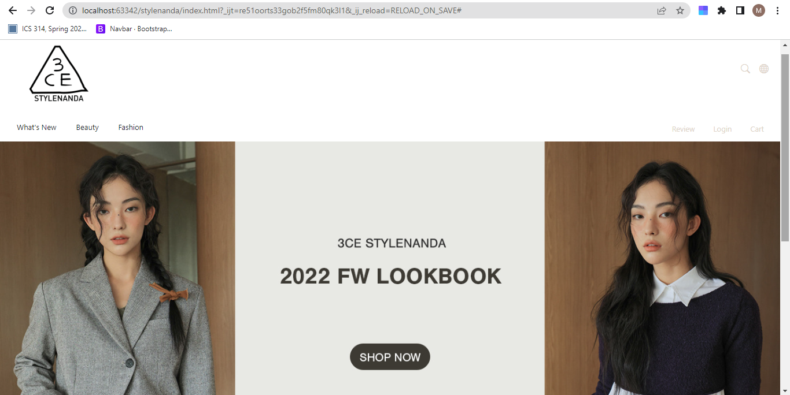

## Exploring UI Frameworks
Despite having played around with HTML, Javascript and CSS for a while now, Bootstrap 5 was my first encounter with a UI Framework.  Although I do find it helpful in some aspects, learning how to use it for the past 2 weeks has been both frustrating and rewarding.  Given my current workload and unforgiving schedule, I have found it hard to carve out the time needed to explore Bootstrap 5 and get more used to working with it.  The sheer amount of utility provided by Bootstrap 5 was, at first, hard to sift through and fully understand.  However, after lots of practice and trial and error, I slowly began to understand the usefulness of the UI Framework.

Once you are able to get past the initial learning curve, however, I believe UI Frameworks makes your life a lot easier when designing a website.  For example, in Bootstrap 5, by simply including the class “container” in your HTML tag, the framework automatically provides you with a general padding for the content of your website.  This saves you the trouble of having to go through the effort to manually add in the HTML and CSS code to perform this task yourself.  Besides container, Bootstrap 5 includes a large variety of other classes (ex. navbar, row, col) that, when called, provide an easier way to design websites and allows coders to cut down on the amount of code they need to write.

## An Example
One major advantage of using UI Frameworks is that it provides you with a way to easily make a rather close replication of an actual website with minimal effort.  Shown above is an example of a recreation of the website “Stylenanda” that I made in IntelliJ IDE using Bootstrap 5.  The picture included on the left is a screenshot of the actual website, the one on the right is a screenshot of my Bootstrap 5 recreation that I worked on for about an hour.  Although there are a few minor differences between the two websites (ex. the logo in my website is slightly bigger than the logo on the Stylenanda one), I was able to make my website look extremely similar to the original despite me only spending an hour on the assignment.  This was mainly due to the utilities offered by Bootstrap 5 that allowed me to cut down on the amount of HTML and CSS I needed to write in order to achieve my desired effects.