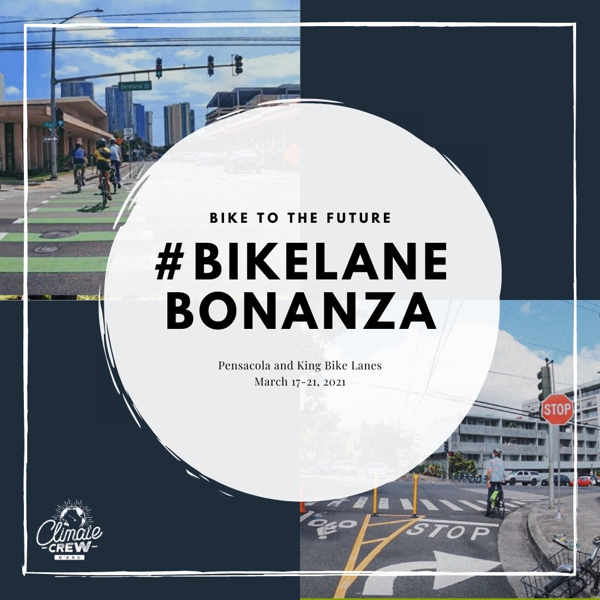

  

To celebrate the opening of the Pensacola and King Bike Lanes on Oahu, my Climate Crew Cohort III worked together with Blue Planet Organization to plan and host a bike lane challenge we titled “Bike Lane Bonanza.”  The goal of this project was to bring attention towards the bike lane and to encourage more people to utilize it.  Participants had the chance to enter a raffle to win prizes such as Patagonia backpacks and a Biki helmet as long as they posted a picture of themselves on instagram riding on the bike lane with the tags “#BikeLaneBonanza” and “@BPF_Changemakers.”

As part of the advertising team, I, and two other team members, worked together to create eye-catching posters for the event.  We also researched good hashtags and catchphrases to use to both make the challenge stand out and make it easier for my team to find the posts of participants to enter them into the raffle.  About a week before the challenge, my team members and I took turns posting to the BPF_Changemakers instagram about the challenge and communicating with the other groups our progress on the advertising.
