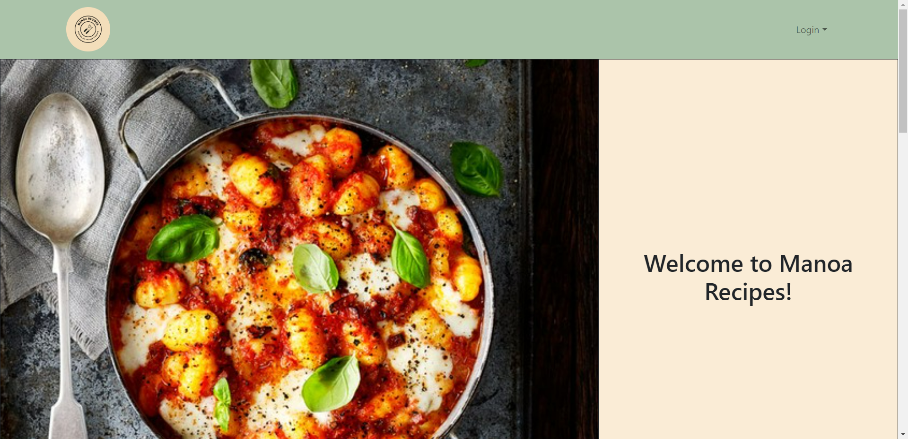
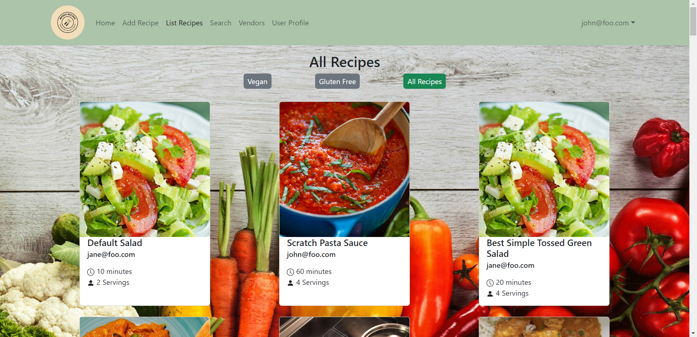
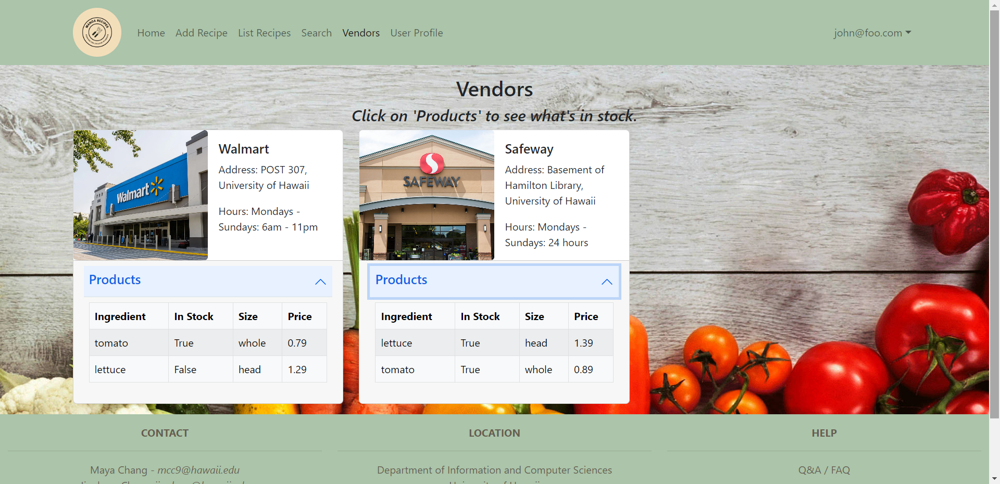
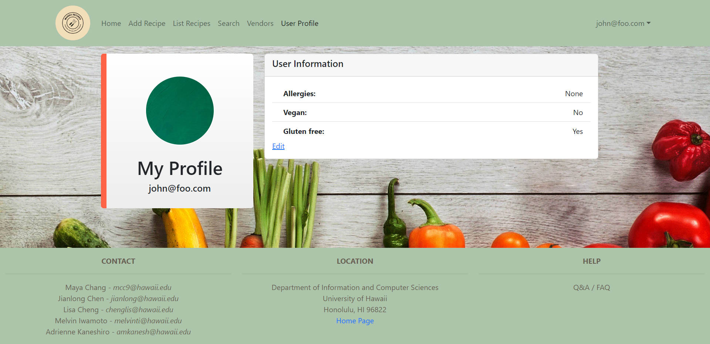
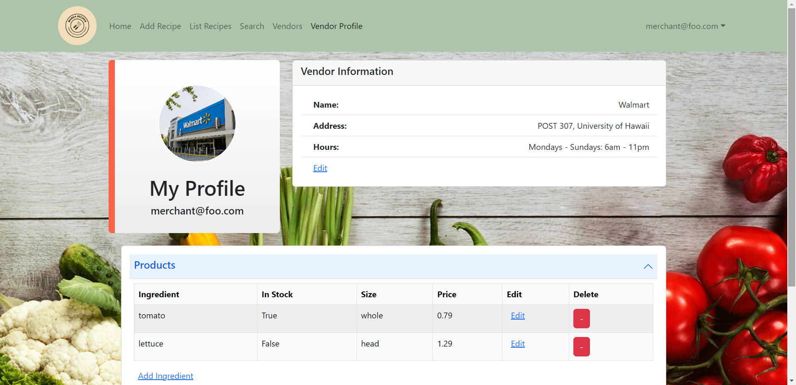

Manoa Recipes is an application that aims to provide college students access to finding and sharing low budget, easy-to-make recipes.

    
    

Depending on the role the user chooses, a different profile is available.

### [Site Home Page](https://manoa-recipes.github.io/)

### [Deployed Website](https://manoa-recipes.site/)

